# UniCourt retrieval sequence: member cases and complaints

This is the order of calls for finding every member case of a mass tort, in
**federal** court (an MDL) and in **state** court (coordinated proceedings such
as a California JCCP, a New Jersey MCL or the Philadelphia mass tort program),
and for downloading each member's complaint when one can be obtained.

Federal data comes from **UniCourt's own repository first** (tier 1), then from
the free CourtListener paths this repo already has (tier 2). **PACER is the
last resort** (tier 3). It runs only with `--allow-pacer` and within
`--max-spend`, and only for gaps the first two tiers left open.

[`unicourt-retrieval.md`](unicourt-retrieval.md) explains why each step works
this way, the error codes and cost controls. All paths below are relative to
`/workspace/{workspaceId}`.

```mermaid
sequenceDiagram
    autonumber
    actor Op as Operator
    participant T as mdl_complaints
    participant S as Local state<br/>(cache, job ids, CSV)
    participant U as UniCourt DEEP API<br/>(own repository)
    participant CL as CourtListener<br/>(free)
    participant P as PACER<br/>(via UniCourt)
    participant C as State court site<br/>(via UniCourt)
    participant F as PDF folder

    Op->>T: run MDL 3140 + state proceedings [--allow-pacer --max-spend N]
    T->>S: load token, workspaceId, courtId map, open jobs
    opt no stored token
        T->>U: POST /generateNewToken (clientId, clientSecret)
        U-->>T: accessToken (never expires, max 10 per account)
    end
    opt resuming a killed run
        T->>U: GET caseUpdate / caseDocumentOrder callbacks for saved job ids
    end

    rect rgba(70, 130, 180, 0.12)
    Note over T,P: Phase A: federal MDL member list (tier 1, then tier 2, PACER last)
    T->>U: GET caseSearch?q=caseNumber:"MDL No. 3140" AND Court:(JPML)
    T->>U: GET caseSearch?q=caseName:"caption" AND Court:(transferee) (md lead case)
    U-->>T: JPML caseId, lead caseId, caseStats.relatedCaseCount, lastFetchDate
    opt lead relatedCaseCount > 0
        loop every page, following nextPageAPI (about 100 rows each)
            T->>U: GET case/{leadCaseId}/relatedCases?pageNumber=n
            U-->>T: caseNumber, caseName, caseId or null
        end
    end
    loop each page of results
        T->>U: GET caseSearch?q=DocketEntry:(text:("MDL No. 3140" OR "md-03140")) AND Court:(Federal)
        U-->>T: member caseIds found by docket text
    end
    T->>CL: JPML docket entries (existing --members path)
    CL-->>T: member case numbers + JPML-attached complaints
    T->>S: merge members, source = related / docket-text / jpml-text
    opt --allow-pacer AND lead relatedCaseCount is 0
        T->>U: PUT caseUpdate {leadCaseId, pacerOptions: associatedCases}
        U->>P: docket report + Associated Cases page (one purchase for the whole MDL)
        loop until COMPLETE or FAILURE
            T->>U: GET caseUpdate/{leadCaseId}
        end
        T->>U: GET case/{leadCaseId}/relatedCases (paged)
        T->>S: add members, source = associated-cases
    end
    end

    rect rgba(60, 160, 110, 0.12)
    Note over T,C: Phase B: state coordinated proceedings (no PACER involved)
    T->>U: GET masterData/court?q=name:"..." (resolve state courtId)
    T->>U: GET masterData/courtServiceStatus (skip courts that are down)
    loop each query page (sort=filedDate, max 1000 pages)
        T->>U: GET caseSearch?q=Party:(defendant name + role) AND Court AND filedDate
        U-->>T: caseId, caseNumber, caseName, matchedObjectArray
    end
    opt coordination order or master case number known
        T->>U: GET caseSearch?q=DocketEntry:(text:"JCCP 5xxx") OR CaseDocument:(text:"...")
        T->>U: GET case/{masterStateCaseId}/relatedCases
    end
    opt member known by number but not in UniCourt
        T->>U: PUT caseImport {caseNumber, courtId or courtSourceId}
        U->>C: fetch case from court site
        loop until COMPLETE or FAILURE
            T->>U: GET caseImport/callbacks/{caseImportCallbackId}
        end
    end
    T->>S: save state members (source = search, flag for review)
    end

    rect rgba(200, 140, 40, 0.12)
    Note over T,F: Phase C: every member case (checkpoint after every case)
    loop each member case
        opt caseId unknown
            T->>U: GET caseSearch with about 40 OR'ed caseNumber terms per request
        end
        alt case not in UniCourt
            opt federal AND --allow-pacer
                T->>U: GET pacer/importCaseByCourtUsingCaseNumber (free Find Case, meta only)
            end
            T->>S: record not-in-unicourt if still missing
        end

        T->>U: GET case/{id} (hasOnlyMetaInfo, participantsLastFetchDate, lastFetchDate)
        alt participants present in UniCourt
            T->>U: GET case/{id}/parties?partyClassification=INDIVIDUAL
            T->>U: GET case/{id}/counsel (normAttorney, normLawFirm)
        else federal, none in UniCourt
            T->>CL: search index party, attorney, firm (existing --resolve-names)
            opt --allow-pacer (most expensive per case)
                T->>U: PUT caseUpdate {fetchParticipantsIfOlderThanDays: 30, pacerOptions}
                U->>P: docket report (PACER fee)
            end
        else state, none in UniCourt
            T->>U: PUT caseUpdate (no pacerOptions)
            U->>C: court site refresh
        end

        T->>U: GET case/{id}/documents?repository=UNICOURT (match Complaint or Petition)
        alt complaint already in UniCourt store
            T->>U: GET caseDocumentDownload/{caseDocumentId}
            U-->>T: signed fileUrl + expiryDate
            T->>F: download PDF now (never cache the URL)
        else complaint attached to a JPML motion
            T->>CL: RECAP PDF (free)
            T->>F: download PDF
        else COURT_SOURCE, price within budget, and (state OR --allow-pacer)
            T->>U: PUT caseDocumentOrder {caseDocumentId, isPreviewOnly: false, reOrder: false, pacerOptions if federal}
            T->>S: save caseDocumentOrderCallbackId before polling
            alt federal
                U->>P: buy PDF (PACER fee)
            else state
                U->>C: buy or fetch PDF (court fee)
            end
            loop until COMPLETE, FAILURE or MANUAL
                T->>U: GET caseDocumentOrder/callbacks/{id}
            end
            T->>U: GET caseDocumentDownload/{caseDocumentId}
            U-->>T: signed fileUrl + expiryDate
            T->>F: download PDF now (never cache the URL)
        else sealed, unavailable, PACER not allowed, or over budget
            T->>S: record status: sealed / unavailable / needs-pacer / skipped-budget
        end
        T->>S: write CSV row (member, plaintiffs, counsel, complaint, data source, freshness, cost)
    end
    end

    T->>U: GET dailyUsage/{date}
    T-->>Op: members.csv, complaints/*.pdf, coverage + spend report
```

## Decision points

| Step | Federal: tier 1, UniCourt | Federal: tier 2, free | Federal: tier 3, PACER (opt-in) | State |
| --- | --- | --- | --- | --- |
| Find the proceeding | `caseSearch` for the JPML docket and the `md` lead case | CourtListener JPML docket | PCL MDL search (`jpmlNumber`) | Court lookup plus the coordination or master case number |
| Member list | `relatedCases` on the lead case plus a docket-text search | CourtListener `--members` | `caseUpdate` with `associatedCases`, then `relatedCases` | `caseSearch` by defendant, court and date; `relatedCases` on the master case where available |
| Missing member case | Bulk `caseSearch` by case number | CourtListener title lookup | `pacer/importCaseByCourtUsingCaseNumber` (free Find Case) | `PUT caseImport` |
| Plaintiffs and counsel | `parties`, `counsel` | CourtListener search-index party and attorney | `caseUpdate` with `pacerOptions` | `caseUpdate` without `pacerOptions` |
| Complaint | `documents?repository=UNICOURT`, then download | RECAP PDFs attached to the JPML motions | `caseDocumentOrder` with `pacerOptions` | `caseDocumentOrder` without `pacerOptions` |

## Rules the diagram assumes

- **PACER last.** No PACER call is made without `--allow-pacer`. Rows that
  would need PACER are reported as `needs-pacer`, so the gap can be sized and
  priced before anything is bought. Within tier 3, the order is: one
  Associated Cases pull for the whole MDL, then free Find Case imports, then
  complaint orders, then per-case docket updates.
- **Freshness is reported, not silently fixed.** Tier-1 rows carry
  `lastFetchDate`. A stale UniCourt copy can be refreshed only through PACER
  for a federal case.
- **Every async job id is saved before polling.** A killed run resumes by
  polling instead of paying for a second order or update.
- **Always send `reOrder: false`**, and check `price` against `--max-spend`
  before ordering.
- **Download signed URLs immediately.** `fileUrl` expires at `expiryDate`.
- **State members found by search are candidates.** A defendant-plus-court
  search can return unrelated suits against the same defendant, so these rows
  are flagged for review. Federal rows found by docket text are candidates
  too. Rows from `relatedCases` and from the JPML docket are authoritative.

## To verify in the pilot

- Which state courts in the target proceedings UniCourt covers, and whether
  those courts expose documents for ordering. Check with
  `GET masterData/courtSource` and `courtSourceServiceStatus`.
- Whether any state court source fills `relatedCases` for a master or
  coordination case. The spec only guarantees this for PACER's Associated
  Cases page.
- Whether a `MANUAL` status on `caseDocumentOrder` needs operator action. The
  status appears in the spec without a description.
